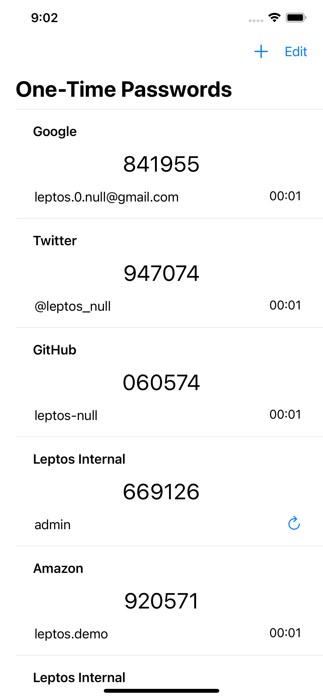
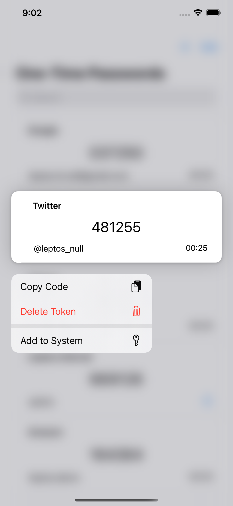
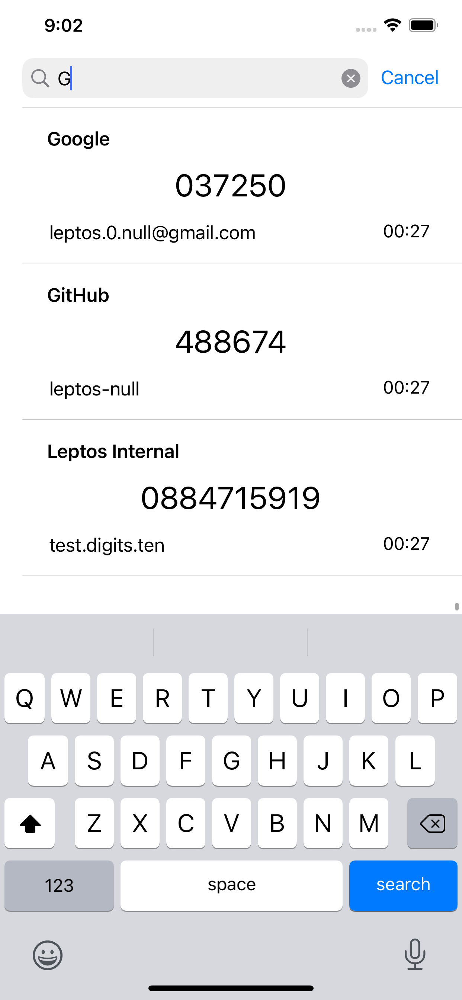
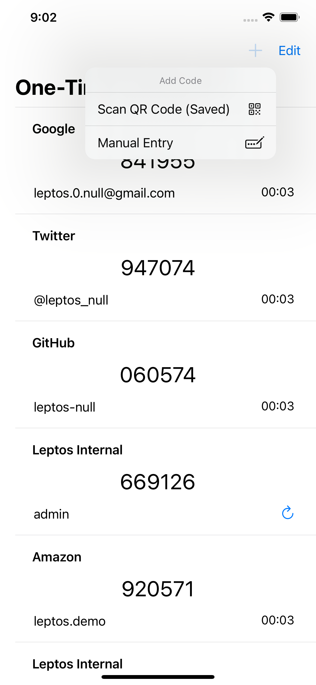
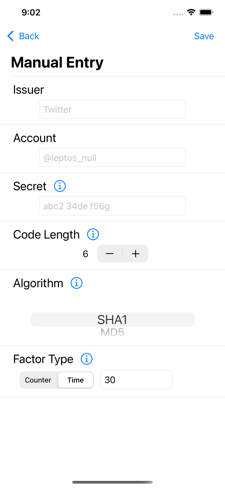
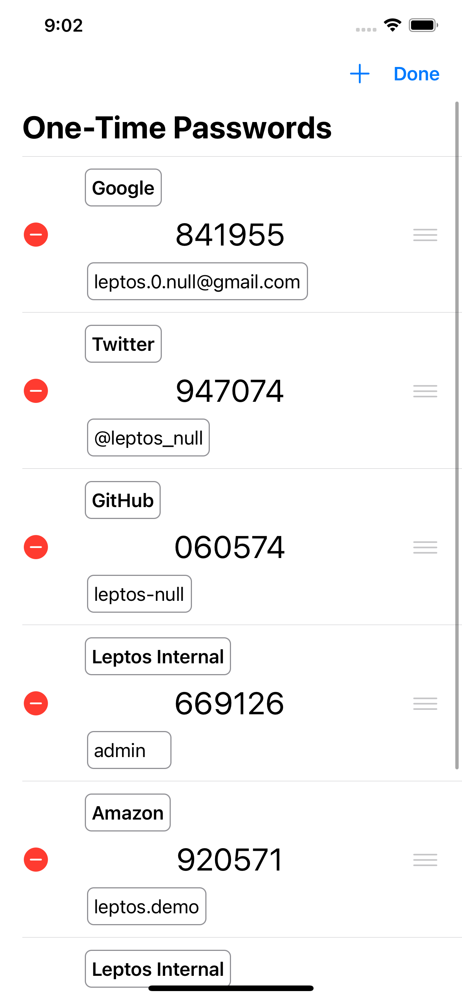

## OneTime

One-Time Password (OTP) iOS client

### Features

- Add Software Two Factor Tokens using:

    - QR scanner in-app

    - Open otpauth URL

    - QR codes in saved images

    - Drag-and-drop QR code into app

    - Manually enter generator configuration

- Store tokens in iCloud Keychain

- Copy current factor code

- Edit the name of the issuer and account of tokens

- Search tokens by issuer, account, or comment content

- Supports tokens of:

    - 1 to 10 digits

        - The limitation of 10 digits is due to [Section 5.3 of the HOTP](https://tools.ietf.org/html/rfc4226#section-5.3) specification. The largest value described is "2^{31}-1" (`2147483647`) which is 10 digits.

    - SHA1, MD5, SHA256, SHA384, SHA512, and SHA224 hashing algorithms

    - Time based factor with any time step/period

    - Counter based factor

### Resources

[RFC4226](https://tools.ietf.org/html/rfc4226) (HOTP)

[RFC6238](https://tools.ietf.org/html/rfc6238) (TOTP)

[mattrubin/OneTimePassword](https://github.com/mattrubin/OneTimePassword) (Swift OTP library)

[google/google-authenticator](https://github.com/google/google-authenticator) (Google OTP client)

### Screenshots

 
 
 
